# 🔗 URL Shortener

A production-ready full-stack URL Shortener built with **React**, **Node.js**, **Express**, **MongoDB Atlas**, **Redis Cloud**, and **BullMQ**.

It supports secure authentication, anonymous and authenticated URL shortening, Redis-powered caching, asynchronous click analytics, and a modern dashboard for managing shortened URLs. It is designed with scalability, performance, and clean architecture in mind.

---


## 🚀 Live Demo

**Frontend:** https://url-shortener-one-orcin.vercel.app

---

## ✨ Features

 🔐 JWT Authentication using HttpOnly Cookies
 🔗 Anonymous URL Shortening
 👤 User Registration & Login
 ✏️ Custom Short URLs
 📊 Click Analytics
 ⚡ Redis Caching for Fast Redirects
 🚀 BullMQ Background Worker
 🗑️ Delete URLs
 📝 Edit Custom Slug
 📋 User Dashboard
 🛡️ Rate Limiting
 📄 Request Logging
 ❤️ Health Check Endpoint

---

## 🛠️ Tech Stack

| Category | Technology |
|----------|------------|
| Frontend | React, Vite, Tailwind CSS |
| Backend | Node.js, Express.js |
| Database | MongoDB Atlas |
| Cache | Redis Cloud |
| Queue | BullMQ |
| Authentication | JWT + HttpOnly Cookies |
| Routing | TanStack Router |
| Data Fetching | TanStack Query |
| State Management | Redux Toolkit |
| Deployment | Vercel, Render |

---

## 🚀 Performance Benchmark

The application was benchmarked under concurrent load to evaluate throughput and response latency.

| Metric | Value |
|---------|-------|
| Concurrent Virtual Users | 500 |
| Total Requests Processed | 18,616 |
| Throughput | ~1,829 requests/sec |
| Successful Redirects | 16,140 |
| Median Response Time | 288 ms |
| P95 Response Time | 374 ms |
| Test Duration | 10 seconds |


### Performance Optimizations

- ⚡ Redis caching reduces repeated MongoDB lookups.
- 🚀 BullMQ processes click analytics asynchronously.
- 📈 Stateless backend designed for horizontal scaling.
- 🛡️ Rate limiting protects the API from abuse.
## 📂 Project Structure

```
url-shortener/
│
├── FRONTEND/
│
├── BACKEND/
│
├── package.json
├── loadtest.js
└── README.md
```

---


## 🏗️ System Architecture

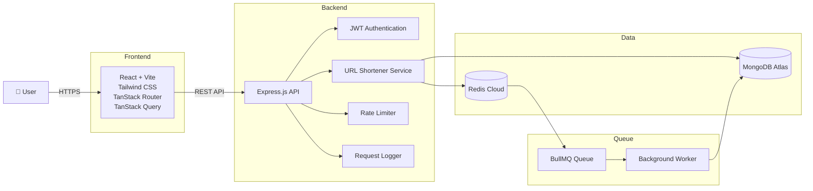

## 🔄 URL Redirection Flow

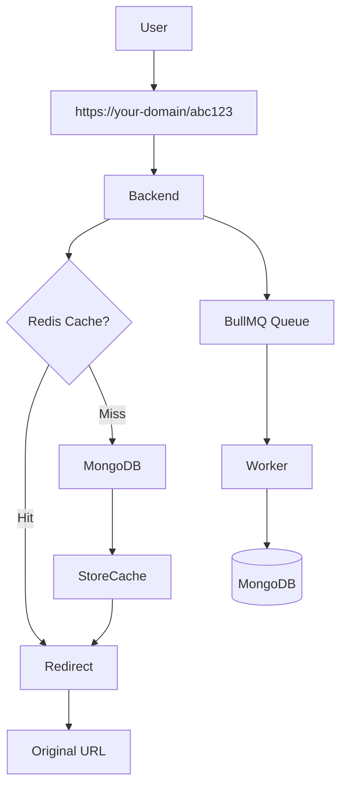

## 🔐 Authentication Flow

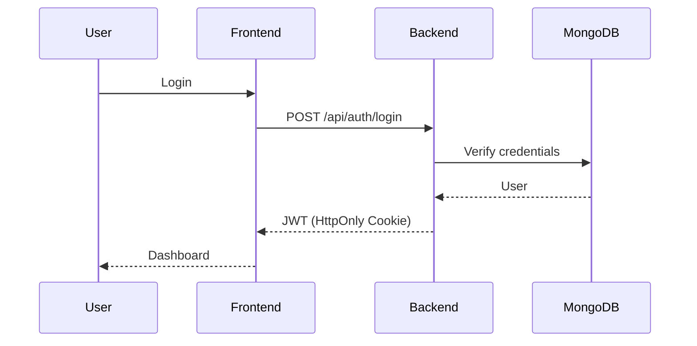

## ☁️ Deployment

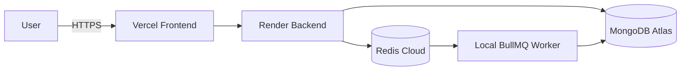


## 📸 Screenshots

### 🏠 Home Page

The landing page allows users to shorten URLs instantly without requiring authentication.

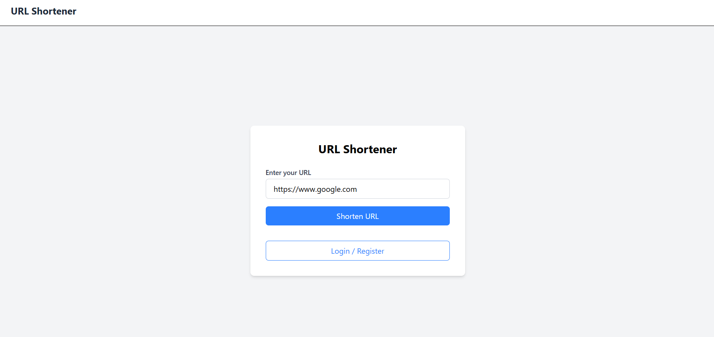

---

### 🔐 User Authentication

Secure user registration and login using JWT authentication with HttpOnly cookies.

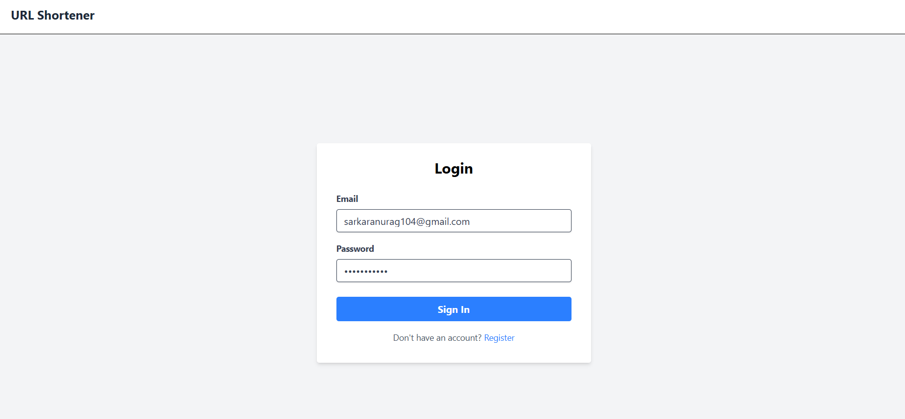

---

### 📋 User Dashboard

A centralized dashboard where authenticated users can manage all their shortened URLs.

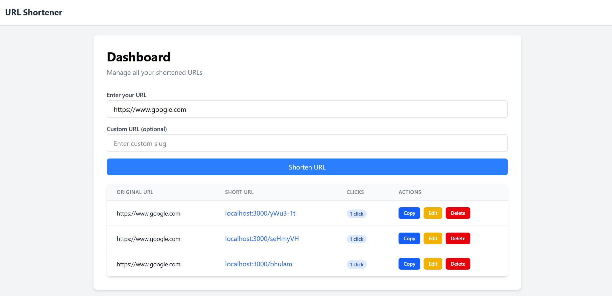

---

### 🔗 Create Custom Short URL

Create branded short links with custom slugs and instant validation.

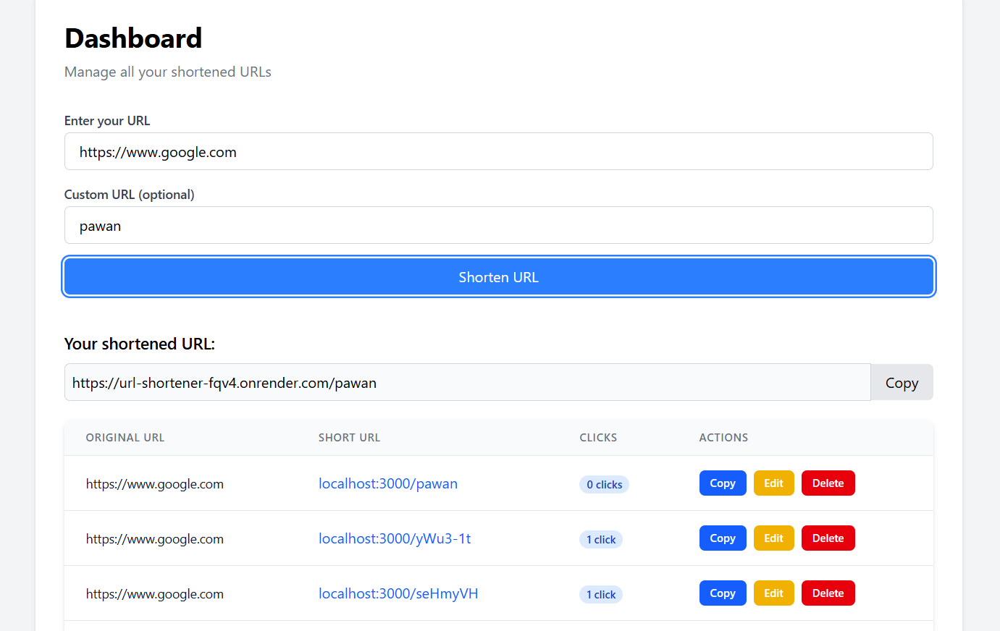

---

### ✏️ Edit & Delete URLs

Update custom slugs or remove URLs directly from the dashboard.

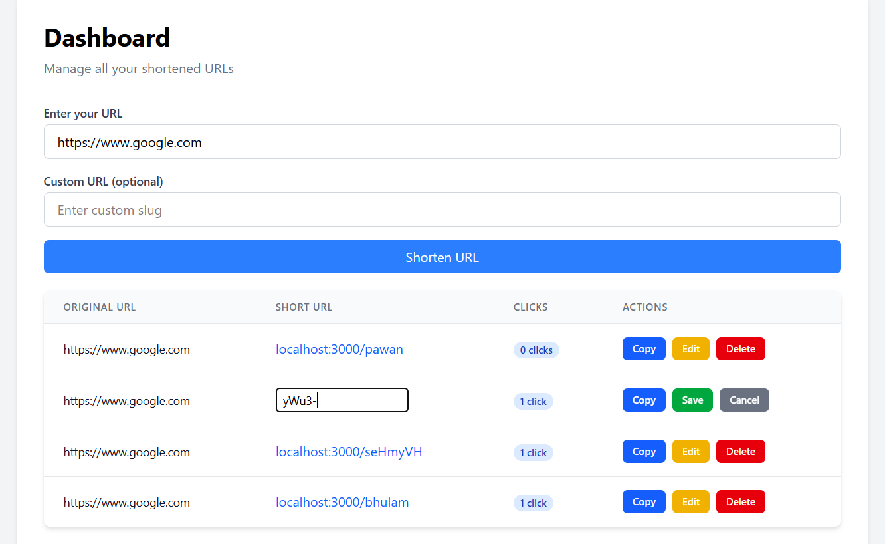

---

### 📊 Click Analytics

Track URL performance with click analytics and usage statistics.

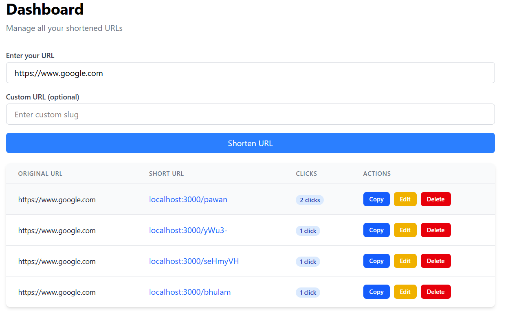

---

### 📱 Responsive Design

Fully responsive interface optimized for desktop, tablet, and mobile devices.

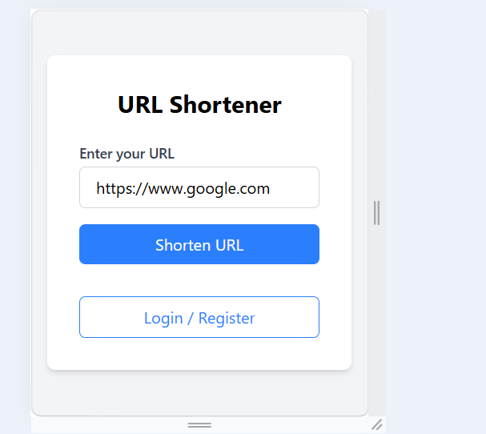

---

## 🏛️ System Design Decisions

### Redis Caching
- Frequently accessed short URLs are cached in Redis to minimize MongoDB queries and improve redirect performance.

### Asynchronous Click Analytics
- Click events are processed using BullMQ background workers, ensuring that analytics updates do not delay user redirects.

### Stateless Backend
- The backend is stateless, allowing multiple application instances to run behind a load balancer for horizontal scaling.

### Secure Authentication
- JWT tokens are stored in HttpOnly cookies to reduce exposure to client-side scripts.

### Database
- MongoDB Atlas is used as the primary persistent data store for users, URLs, and analytics.


# 📚 API Documentation

## Base URL

### Production

```text
https://url-shortener-fqv4.onrender.com
```

### Local Development

```text
http://localhost:3000
```

---

# Authentication

Authentication is handled using **JWT stored in HttpOnly Cookies**.

After a successful login or registration, the backend automatically sets the authentication cookie.

---

# API Endpoints

## Authentication

### Register User

```http
POST /api/auth/register
```

### Request Body

```json
{
  "name": "Rohit Singh",
  "email": "rohit@example.com",
  "password": "password123"
}
```

### Success Response

```json
{
  "message": "register success"
}
```

---

## Login

```http
POST /api/auth/login
```

### Request Body

```json
{
  "email": "rohit@example.com",
  "password": "password123"
}
```

### Success Response

```json
{
  "message": "login success",
  "user": {
    "_id": "...",
    "name": "Rohit Singh",
    "email": "rohit@example.com"
  }
}
```

---

## Logout

```http
POST /api/auth/logout
```

### Success Response

```json
{
  "message": "logout success"
}
```

---

## Get Current User

```http
GET /api/auth/me
```

### Success Response

```json
{
  "user": {
    "_id": "...",
    "name": "Rohit Singh",
    "email": "rohit@example.com"
  }
}
```

---

# URL Management

## Create Short URL (Anonymous)

```http
POST /api/create
```

### Request

```json
{
  "url": "https://google.com"
}
```

### Response

```json
{
  "shortUrl": "https://your-domain/abc123"
}
```

---

## Create Custom Short URL (Authenticated)

```http
POST /api/create
```

### Request

```json
{
  "url": "https://google.com",
  "slug": "google"
}
```

### Response

```json
{
  "shortUrl": "https://your-domain/google"
}
```

---

## Redirect

```http
GET /:shortCode
```

Example

```text
GET /abc123
```

Response

```
302 Redirect
```

Redirects the user to the original URL.

---

## Get User URLs

```http
GET /api/user/urls?page=1&limit=10
```

Authentication Required

### Response

```json
{
  "success": true,
  "urls": [],
  "pagination": {
    "page": 1,
    "limit": 10,
    "total": 5,
    "totalPages": 1
  }
}
```

---

## Update Custom Slug

```http
PATCH /api/user/url/:id
```

Authentication Required

### Request

```json
{
  "slug": "newslug"
}
```

### Response

```json
{
  "success": true,
  "url": {}
}
```

---

## Delete URL

```http
DELETE /api/user/url/:id
```

Authentication Required

### Response

```json
{
  "success": true,
  "message": "URL deleted successfully"
}
```

---

# Health Check

```http
GET /health
```

### Response

```json
{
  "status": "OK"
}
```


---

# Response Status Codes

| Status Code | Description |
|------------|-------------|
| 200 | Success |
| 201 | Resource Created |
| 302 | Redirect |
| 400 | Bad Request |
| 401 | Unauthorized |
| 403 | Forbidden |
| 404 | Resource Not Found |
| 409 | Duplicate Resource |
| 429 | Too Many Requests |
| 500 | Internal Server Error |

---

# Security Features

- JWT Authentication
- HttpOnly Cookies
- Rate Limiting
- Redis Caching
- Request Logging
- Input Validation
- Password Hashing
- Protected Routes


---

## 🚀 Future Improvements

- QR Code Generation
- URL Expiration
- Password Protected Links
- Docker Support
- CI/CD Pipeline
- Custom Domains
- Advanced Analytics

---

## 👨‍💻 Author

**Rohit Singh**


If you found this project interesting, feel free to ⭐ the repository.
